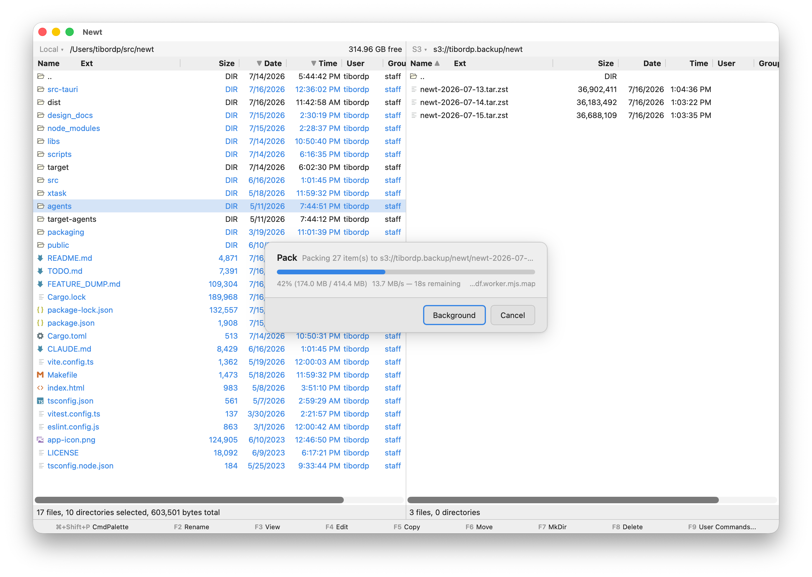

# Newt

*"If Altap Salamander and vscode had a baby..."*

A dual-pane file manager for Linux, macOS, and Windows in the orthodox tradition — two panes, a
terminal underneath, and your hands never leaving the keyboard. Local files are only the start:
open an SSH session and the whole app runs against the remote machine, mount S3 buckets and
archives as ordinary directories, and copy between any of them with full progress and conflict
handling. Built with Tauri 2 — Rust backend, React/TypeScript frontend.



## Features

- **Two panes, one terminal** — side-by-side directory listings over a collapsible multi-tab
  terminal (xterm.js). Tab switches panes, the splitters drag, and clicking chrome never steals
  focus from the file list.
- **Keyboard-first** — F-key operations (F3 view, F4 edit, F5 copy, F8 delete…), incremental
  quick-search by typing, a visual regex filter, a command palette, and a keybindings editor;
  every command is rebindable with per-context bindings.
- **Remote sessions** — connect over SSH and the entire session (both panes, terminals, file
  operations) runs on the remote host through a small agent binary speaking a binary RPC protocol
  over stdin/stdout. Your local filesystem stays reachable inside the session, so local↔remote
  copies are just copies. Elevated sessions (pkexec / UAC) and WSL sessions work the same way.
- **Virtual filesystems** — mount S3 (with extended properties: ACLs, storage class, user
  metadata), SFTP, and read-only Kubernetes; browse zip/tar/tar.gz/tar.zst archives in place,
  even when the archive itself lives on S3. VFS mounts are per-pane and orthogonal to the session
  — an S3 mount inside an SSH session uses the remote host's credentials and network.
- **Recursive search as a filesystem** — Find in Folder streams matches into a flat pane you can
  operate on directly; open, copy, delete, and drag act on the real underlying files.
- **Viewer and editor** — F3 views text, hex, images, audio, video, and PDF, streaming remote
  files by range instead of downloading them; F4 edits in Monaco with language detection.
- **User commands** — define your own commands with Jinja-style templates over the selection,
  prompts for input, and terminal or background execution, on their own palette (F9).
- **Hot paths, history, and profiles** — bookmarks and standard folders one keystroke away,
  per-pane navigation history with a step-back overlay, connection profiles with quick connect,
  and multiple windows. Preferences live in a hot-reloaded TOML file with a schema-driven
  settings dialog, per-profile overrides, and light/dark/system themes.

## How it works

The Rust backend is the source of truth: application state lives in the Tauri process and is
pushed to the frontend as patches (treediff → Immer), so the React layer renders state rather
than owning it — even modal dialogs are driven from Rust.

All filesystem, terminal, and operation functionality sits behind traits with two
implementations: a local one that runs in-process, and a remote proxy that forwards each call
over a bincode RPC protocol to the agent binary. A local session and an SSH/elevated/WSL session
are therefore the same code — the only difference is which side of the RPC boundary does the
work. VFS backends (S3, SFTP, archives, Kubernetes, search) implement one `Vfs` trait and mount
into either side, and file operations are written once against these traits, so a copy from an
archive-on-S3 in a remote session to the local disk is the ordinary code path, not a special
case.

## Building

Requires Rust and Node.js.

```sh
npm install
cargo tauri dev      # development app
cargo tauri build    # release bundles
```

Remote and elevated sessions need agent binaries: `cargo xtask agents` builds them for every
target the host can produce (Linux agents cross-compile from any host via cargo-zigbuild; see
`cargo xtask help`). Rust tests run with `cargo test`, frontend tests with `npm test`. CI builds
and tests every push to master; packaging (bundles for all three OSes) is a manual workflow run.

## License

Licensed under the [GNU GPL v3.0](LICENSE) (GPL-3.0-or-later). The vendored
[`pty-process`](libs/pty-process/) fork keeps its original MIT license.
